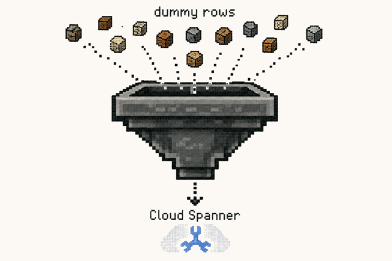

<p align="center">
  
</p>

<h1 align="center">hopper</h1>

<p align="center">
  <a href="https://github.com/daichirata/hopper/actions/workflows/test.yaml"></a>
  <a href="https://github.com/daichirata/hopper/releases/latest"></a>
  <a href="LICENSE"></a>
</p>

`hopper` is a command-line tool to generate and load dummy data into Google Cloud Spanner.

It reads the schema directly from the target database, fills every column with a
type-appropriate random value by default, and lets you override individual columns
with [gofakeit](https://github.com/brianvoe/gofakeit) templates. Interleaved and
foreign-key relationships are handled automatically.

The examples below use the [Spanner sample schema](https://cloud.google.com/spanner/docs/schema-and-data-model) (`Singers` → `Albums` → `Songs`, interleaved).

## Installation

```
go install github.com/daichirata/hopper@latest
```

Or use the Docker image, published to `ghcr.io/daichirata/hopper` on each tagged release:

```
docker run --rm ghcr.io/daichirata/hopper run --help
```

## Quick start

```
# 1000 rows into Singers (primary key auto-generated, other columns randomized)
hopper run spanner://projects/p/instances/i/databases/d --table 'Singers=1000'
```

The database is given as a `spanner://` DSN:

```
spanner://projects/{projectId}/instances/{instanceId}/databases/{databaseName}?credentials=/path/to/keyfile.json
```

| Param          | Required | Description                                                              |
|----------------|----------|--------------------------------------------------------------------------|
| `projectId`    | true     | The Google Cloud Platform project id                                     |
| `instanceId`   | true     | The id of the instance running Spanner                                   |
| `databaseName` | true     | The name of the Spanner database                                         |
| `credentials`  | false    | Path to the keyfile. If omitted, the default application credentials are used. |

When `SPANNER_EMULATOR_HOST` is set, hopper talks to the emulator (no credentials needed).

## Commands

| Command | Description |
|---------|-------------|
| `hopper run DATABASE`      | generate dummy data and load it into Spanner |
| `hopper scaffold DATABASE` | print a starter config (YAML) from the schema |
| `hopper version`           | print the version |

The rest of this README covers `run`, the main command. Run `hopper <command> --help`
for the full set of flags. While loading, `run` prints per-table progress
(`Table  inserted/total`) to stderr.

## Tables and row counts

`--table TABLE=N` (repeatable) sets the **total** number of rows for a table:

```
--table 'Singers=10'
--table 'Albums=1000'
```

Parent/child relationships are read from the schema, so you only provide counts:

- **Interleaved** (`INTERLEAVE IN PARENT`) and **foreign-key** tables are generated
  parent-first. Interleaved children inherit the parent's primary key; FK columns
  reference a random row of the parent — so referential integrity always holds.
- Children are distributed across their parents **round-robin**. `Singers=10` +
  `Albums=1000` gives ~100 Albums per Singer; choose the totals to set the ratio
  (`Albums=300` → ~30 each).
- Naming only a child **auto-completes its parents** (one row each):
  `--table 'Albums=300'` creates 1 Singer with 300 Albums under it.

## Column values

Every column is filled automatically; use `--set` to override specific ones.

**Defaults** — when a column has no `--set`:

- **Primary keys and unique-index columns** get a collision-free unique value (UUID for STRING, sequential for INT64, …).
- **Other columns** are inferred from the column name when it matches a gofakeit
  function (`Email`, `FirstName`, `Phone`, …); otherwise a type-appropriate random
  value is used. Add `--no-infer` to disable name inference.
- **Commit-timestamp** columns (`OPTIONS (allow_commit_timestamp=true)`) are set to the pending commit timestamp.
- **Generated / stored** columns are skipped.
- `--null-rate` (0–1) randomly leaves nullable columns NULL.

**Overrides** — `--set TABLE.COLUMN=TEMPLATE`, a
[gofakeit](https://github.com/brianvoe/gofakeit#templates) template using `{{ }}`:

```
--set 'Albums.MarketingBudget={{ Number 0 1000000 }}'
--set 'Singers.FirstName={{ FirstName }}'
--set 'Singers.LastName={{ FirstName }}-{{ Index }}'
```

`TABLE` is matched by name, so the leaf table name is enough. Common building blocks:

| Template                                       | Result                                    |
|------------------------------------------------|-------------------------------------------|
| `{{ Number 0 100 }}`                           | random integer in a range                 |
| `{{ Float64 }}`                                | random float                              |
| `{{ LetterN 12 }}`                             | 12 random letters                         |
| `{{ Regex "[A-Z0-9]{8}" }}`                    | string matching a regex                   |
| `{{ UUID }}`                                   | a UUID                                    |
| `{{ RandomString (SliceString "a" "b" "c") }}` | pick one of the values                    |
| `{{ FirstName }}` `{{ Email }}` `{{ Phone }}`  | realistic fake data                       |
| `{{ Sentence 5 }}`                             | a 5-word sentence                         |
| `{{ Index }}`                                  | row sequence number (0-based)             |
| `{{ add Index 1 }}`                            | arithmetic: `add` `sub` `mul` `div` `mod` |
| `{{ Col "FirstName" }}`                        | value of another column in the same row   |

`{{ Index }}`, the arithmetic helpers, and `{{ Col }}` are hopper additions; everything
else is a gofakeit function (any [gofakeit function](https://github.com/brianvoe/gofakeit#functions)
works). Templates can be combined (`{{ FirstName }}-{{ Index }}`), and the result is
converted to the column's type — use a numeric template for numeric columns. ARRAY
columns get a single templated element (or a few random ones by default).

`{{ Col "OtherColumn" }}` reads a column already generated for the same row, so you can
derive one value from another (`--set 'Singers.Nickname={{ Col "FirstName" }}-{{ Index }}'`).
Columns are generated in schema order, so reference only columns that come earlier.

## Configuration file

For anything non-trivial, use a YAML file. Generate a starting point with
`hopper scaffold DATABASE [--table T]`: every column is listed — name-inferred ones
are pre-filled, the rest are commented out (`# Column:`) for you to fill in — while
primary keys and generated columns are skipped. Edit it, then pass it with `--config`:

```yaml
tables:
  Singers:
    rows: 10
    columns:
      FirstName: "{{ FirstName }}"
      LastName: "{{ LastName }}"
  Albums:
    rows: 1000
    columns:
      AlbumTitle: "{{ Sentence 3 }}"
      MarketingBudget: "{{ Number 0 1000000 }}"
```

`--config` can be combined with `--table` / `--set`, which override or extend it —
handy for bumping a count or tweaking one column without editing the file.

## Flags

```
-c, --config string     path to a YAML config file
    --table             total rows as TABLE=N                  (repeatable)
    --set               column template as TABLE.COLUMN=TEMPLATE (repeatable)
    --truncate          delete existing rows from each table before loading
    --null-rate float   probability (0-1) of leaving a nullable column NULL
    --no-infer          disable inferring a gofakeit function from column names
    --seed int          random seed (0 = time-based)
    --dry-run           generate rows but do not insert (prints a few sample rows)
```

## Development

```
make build          # build ./bin/hopper
make test           # unit tests
make deps           # go get -t ./... && go mod tidy
```

End-to-end test against the Cloud Spanner emulator:

```
docker run -d -p 9010:9010 -p 9020:9020 gcr.io/cloud-spanner-emulator/emulator
SPANNER_EMULATOR_HOST=localhost:9010 go test -tags e2e ./internal/hopper
```

## License

MIT
